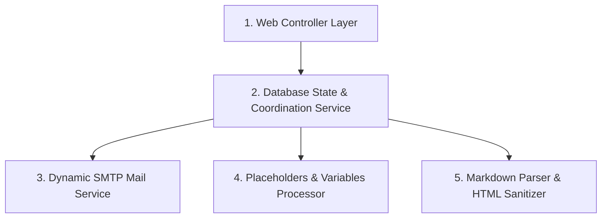

# 🚀 B2B Outreach Platform - Email Outreach & Automation

The B2B Outreach Platfrom is a production-ready, secure, and modern **Bulk Email Outreach & Automation Platform** built on the Spring Boot stack. It empowers users to manage company leads, draft templates using rich styling, configure custom SMTP gateways, and run scheduled background email campaigns with robust anti-spam throttling.

---

## 🛠️ Technology Stack & Badges


---

## 🌟 Key Features

1. 📝 **Quill WYSIWYG Editor**: Replace generic textareas with a rich-text toolbar allowing headers, bold/italics/underlines, lists, links, and inline text formatting.
2. 👁️ **Live Responsive Preview**: Real-time side-by-side card rendering variables (like `{{company_name}}` and `{{contact_person}}`) to show the user exactly what the recipient sees.
3. 📥 **Excel Lead Import**: Parse and validate `.xlsx` and `.xls` lists. Handles blank rows, duplicate emails, and logs import status.
4. 📎 **Template Attachments**: Upload attachments (PDFs, spreadsheets, images, up to 10MB) stored in the database as binary blobs and sent with the template.
5. 🛡️ **XSS Protection**: Uses **Jsoup HTML Sanitizer** to filter templates and protect against script injections while keeping safe CSS styling intact.
6. 🔑 **SMTP Cryptography**: Encrypts password credentials with AES inside the database. Connection health is tested via AJAX APIs.
7. 🚦 **Anti-Spam Controls**: In-memory locking prevents concurrent scheduler overlaps (double-sending). Includes randomized wait intervals between emails.
8. 🌙 **Persistent Dark Mode**: Premium glassmorphism layout that toggles themes and saves states locally.
9. 📊 **Performance Reports**: Generates campaign analysis, exportable directly to PDF, Excel, or CSV.

---

## 🏗️ Clean Layered Architecture

To achieve high maintainability and security, the backend is organized into five decoupled layers:



- **Controller**: Manages user input, REST endpoints, and form validation flows.
- **Service**: Processes business logic constraints (e.g. checking lead counts, encrypting credentials, or scheduling).
- **MailService**: Manages network configurations, sockets, connection timeouts, and mail message construction.
- **TemplateProcessor**: Dynamically swaps placeholder tokens (`{{company_name}}`, `{{contact_person}}`, `{{name}}`, `{{team}}`, `{{sender}}`) in content.
- **HTML Renderer**: Processes markdown syntax (like `# Headers` and `**Bold**`) and sanitizes text against XSS using Jsoup.

---

## ⚙️ Development Tools & Libraries Used

* **Spring Mail Starter**: JavaMail connection helper wrapper.
* **Commonmark-Java**: Lightweight parser to translate Markdown syntax into compliant HTML tags.
* **Jsoup**: Robust library to parse, clean, and secure HTML markup from cross-site scripts.
* **Apache POI**: Dynamic Excel engine to read spreadsheets and import records.
* **OpenPDF**: Java library used to create rich analytical report PDF exports on the fly.
* **Lombok**: Simplifies domain data mappings.

---

## 🚀 Getting Started

### 1. Database Setup
Make sure you have a local MySQL server running. Connect to your database server and execute:
```sql
CREATE DATABASE IF NOT EXISTS cold_email_automation;
```
*(Hibernate's `ddl-auto=update` configuration will automatically generate all table schemas, indexes, and relations when the application starts).*

### 2. Configure Environment Properties
The application database credentials can be customized in `src/main/resources/application.properties`:

```

### 3. Run the Application
Open your terminal in the project `/demo` root directory and run:
```powershell
mvn spring-boot:run
```
---

---

## 📁 Directory Structure

* `config/` — Web Security and Password encoder definitions.
* `security/` — Custom UserDetailsService connecting to JPA database users.
* `entities/` — JPA Hibernate data models mapping database tables.
* `repositories/` — Repository interface query layers.
* `services/` — Business services (AES encryption, Excel parsers, PDF generators, background email threads).
* `controllers/` — Spring MVC controllers.
* `templates/` — HTML Thymeleaf views.
* `static/css/` & `static/js/` — Styling sheets, theme scripts, and connection test AJAX queries.
